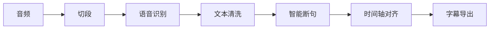

# Subtap

[](https://opensource.org/licenses/MIT)
[](https://www.python.org/downloads/)
[](https://www.apple.com/macos/)
[]()

**本地优先的 AI 字幕生成引擎** — 基于 MLX Qwen3 的端到端字幕工具，完全离线运行。

> 当前版本为开发版源码安装，仅支持 macOS 13.5+ Apple Silicon。Intel x86_64 暂未验证，不在当前支持范围内。不提供 Developer ID 签名、公证或正式二进制分发。

## 特性

- **完整 Pipeline** — 音频标准化 → 切段 → 语音识别 → 文本清洗 → 智能断句 → 时间轴对齐 → 字幕导出
- **真实模型推理** — Qwen3-ASR（0.6B/1.7B）+ Qwen3-ForcedAligner，基于 Apple MLX 优化
- **中文优先** — 全部界面和状态提示均为中文
- **TUI 可视化** — 实时阶段进度、模型状态、执行摘要
- **插拔式架构** — ASR / LLM / Aligner 后端可替换
- **中间产物落盘** — 所有阶段输出 JSONL，支持断点续跑

## 开源对标能力

- 本地离线是默认主路径，不接入第三方 API 也能生成可交付字幕。
- OpenAI 兼容、Anthropic Messages、自定义 URL 是可选 ASR / LLM API 后端格式。
- 项目管理只使用本地文件系统，不做账号、云同步、商业激活或权限系统。

## 快速开始

### 环境要求

- Python 3.10+
- macOS 13.5+（Apple Silicon）
- 约 4 GB 磁盘空间（用于模型）

### 安装

```bash
# 克隆项目
git clone https://github.com/R-jed/Subtap.git
cd Subtap

# 创建虚拟环境
python3 -m venv .venv
source .venv/bin/activate

# 安装
pip install -e .

# 初始化（交互式模型下载）
subtap setup

# 检查环境
subtap doctor
```

### 模型安装

模型统一放在项目根目录 `models/`：

| 模型 | 大小 | 用途 | 必需 |
|------|------|------|------|
| Qwen3-ASR-0.6B | 约 960 MB | 快速语音识别 | ✓ |
| Qwen3-ASR-1.7B | 约 2.3 GB | 高质量语音识别 | 可选 |
| Qwen3-ForcedAligner-0.6B | 约 1.2 GB | 时间轴对齐 | ✓ |

`subtap setup` 支持四种下载方式：

1. Hugging Face 直连
2. Hugging Face 国内镜像（`hf-mirror.com`）
3. ModelScope（`modelscope.cn`）
4. 手动下载后放入 `models/`

### 基本用法

```bash
# 生成字幕
subtap run video.mp3

# 运行演示
subtap demo
```

## Pipeline



每个阶段输出 JSONL 中间产物到 `work/` 目录，支持断点续跑。

## CLI 命令

```bash
# 运行完整流程
subtap run video.mp3

# 运行演示
subtap demo

# 检查环境
subtap doctor
subtap doctor --release    # 发布验收检查
subtap doctor --json       # 机器可读输出

# 管理模型
subtap models list
subtap models install asr_0.6b
subtap models verify

# 初始化向导
subtap setup
```

## 配置

配置文件位置：`~/.subtap/config.yaml`

```yaml
# ASR 配置
asr:
  backend: mlx-qwen-asr
  model: asr_0.6b

# 对齐配置
align:
  backend: mlx-qwen-aligner

# 输出配置
output:
  timestamp: true
  keep_versions: 5
```

## 项目结构

```
Subtap/
├── src/subtap/           # 源代码
│   ├── core/             # 核心模块
│   │   ├── pipeline.py   # 流水线编排
│   │   ├── models.py     # 模型管理
│   │   └── setup.py      # 初始化向导
│   ├── backends/         # 后端实现
│   │   ├── asr/          # ASR 后端
│   │   ├── llm/          # LLM 后端
│   │   └── aligner/      # 对齐后端
│   ├── schemas/          # 数据模型
│   ├── ui/               # 用户界面
│   └── cli.py            # CLI 入口
├── configs/              # 配置文件
├── tests/                # 测试
├── models/               # 模型文件（gitignore）
└── pyproject.toml        # 项目配置
```

## 开发

```bash
# 安装开发依赖
pip install -e ".[dev]"

# 运行测试
pytest -v

# 运行单个测试
pytest tests/test_cli.py -v

# 代码检查
ruff check src/
mypy src/

# 发布验收
bash scripts/release-check.sh
```

## 贡献

欢迎提交 Issue 和 Pull Request。

1. Fork 项目
2. 创建特性分支（`git checkout -b feature/amazing-feature`）
3. 提交更改（`git commit -m 'feat: 添加某功能'`）
4. 推送到分支（`git push origin feature/amazing-feature`）
5. 创建 Pull Request

请确保：
- 所有测试通过（`pytest -v`）
- 代码通过 lint 检查（`ruff check`）
- 提交信息遵循 [Conventional Commits](https://www.conventionalcommits.org/) 规范

## 许可证

[MIT](./LICENSE)
