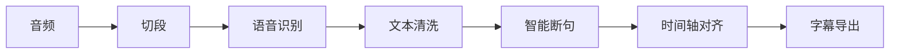

# Subtap

**本地优先的 AI 字幕生成引擎** — 基于 MLX Qwen3 的端到端字幕工具，完全离线运行。

## 特性

- **完整 Pipeline**：音频标准化 → 切段 → 语音识别 → 文本清洗 → 智能断句 → 时间轴对齐 → 字幕导出
- **真实模型推理**：Qwen3-ASR (0.6B/1.7B) + Qwen3-ForcedAligner，基于 Apple MLX 优化
- **中文优先**：全部界面和状态提示均为中文
- **TUI 可视化**：实时阶段进度、模型状态、执行摘要
- **插拔式架构**：ASR / LLM / Aligner 后端可替换
- **中间产物落盘**：所有阶段输出 JSONL，支持断点续跑

## 支持范围

当前版本面向 macOS 开发版源码安装，已在 Apple Silicon 环境验证。当前不提供 Developer ID 签名、公证或正式二进制分发。

## 安装

```bash
# 克隆项目
git clone <repo-url>
cd Subtap

# 创建虚拟环境
python3 -m venv .venv
source .venv/bin/activate

# 安装
pip install -e .

# 初始化
subtap setup

# 检查环境
subtap doctor
```

## 模型安装

模型统一放在项目根目录 `models/`：

- `models/asr_0.6b`
- `models/asr_1.7b`（可选）
- `models/aligner`

运行 `subtap setup` 后选择模型安装方式：

1. Hugging Face 直连
2. Hugging Face 国内镜像：`https://hf-mirror.com`
3. ModelScope
4. 手动下载后放入 `models/`

## 快速开始

```bash
# 生成字幕
subtap run video.mp3

# 运行演示
subtap demo
```

## Pipeline



## TUI 示例


## 模型说明

| 模型 | 大小 | 用途 |
|------|------|------|
| Qwen3-ASR-0.6B | 约 960 MB | 快速语音识别 |
| Qwen3-ASR-1.7B | 约 2.3 GB | 高质量语音识别 |
| Qwen3-ForcedAligner-0.6B | 约 1.2 GB | 时间轴对齐 |

## CLI 命令

```bash
# 运行完整流程
subtap run video.mp3

# 运行演示
subtap demo

# 检查环境
subtap doctor

# 管理模型
subtap models list
subtap models install asr
subtap models verify

# 初始化
subtap setup
```

## 配置

配置文件位置：`~/.subtap/config.yaml`

```yaml
# 模式配置
mode: hybrid  # fast / quality / hybrid

# ASR 配置
asr:
  backend: mlx-qwen-asr
  model: asr_0.6b

# 对齐配置
align:
  backend: mlx-qwen-aligner

# 输出配置
output:
  timestamp: true
  keep_versions: 5
```

## 许可证

MIT License
