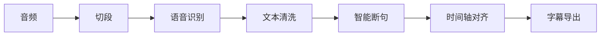

# Phase 17: Release Engineering 实现计划

> **面向 AI 代理的工作者：** 必需子技能：使用 superpowers:subagent-driven-development（推荐）或 superpowers:executing-plans 逐任务实现此计划。步骤使用复选框（`- [ ]`）语法来跟踪进度。

**目标：** 将 Subtap 从"可运行产品"升级为"可发布开源工具"

**架构：** 
- CHANGELOG.md 自动生成
- RELEASE.md 半自动
- demo 系统增强
- README 产品化
- 安装体验验证（自动化）
- release 质量检查脚本
- Git Release 收口

**技术栈：** Git, Bash, Markdown

---

## 文件结构

### 需要创建的文件

| 文件 | 职责 |
|------|------|
| `scripts/generate-changelog.sh` | CHANGELOG.md 自动生成脚本 |
| `scripts/release-check.sh` | release 质量检查脚本 |
| `samples/` | 内置测试音频目录 |
| `docs/tui-screenshot.png` | TUI 截图 |

### 需要修改的文件

| 文件 | 职责 |
|------|------|
| `CHANGELOG.md` | 自动生成 |
| `RELEASE.md` | 半自动 |
| `README.md` | 产品化 |
| `src/subtap/cli.py` | demo 命令增强 |

---

## 任务 1：创建 CHANGELOG.md 自动生成脚本

**文件：**
- 创建：`scripts/generate-changelog.sh`
- 创建：`CHANGELOG.md`

- [ ] **步骤 1：创建脚本目录**

```bash
mkdir -p scripts
```

- [ ] **步骤 2：编写生成脚本**

```bash
#!/bin/bash
# scripts/generate-changelog.sh
# 自动生成 CHANGELOG.md

set -e

echo "# Changelog" > CHANGELOG.md
echo "" >> CHANGELOG.md
echo "## v0.1.0 ($(date +%Y-%m-%d))" >> CHANGELOG.md
echo "" >> CHANGELOG.md

# 从 git log 提取 conventional commits
git log --oneline --no-merges | grep -E "^(feat|fix|docs|refactor|test):" | while read -r line; do
    # 提取类型和描述
    type=$(echo "$line" | cut -d: -f1)
    desc=$(echo "$line" | cut -d: -f2-)
    
    # 根据类型添加 emoji
    case "$type" in
        feat) echo "✨$desc" >> CHANGELOG.md ;;
        fix) echo "🐛$desc" >> CHANGELOG.md ;;
        docs) echo "📚$desc" >> CHANGELOG.md ;;
        refactor) echo "♻️$desc" >> CHANGELOG.md ;;
        test) echo "✅$desc" >> CHANGELOG.md ;;
    esac
done

echo "CHANGELOG.md 已生成"
```

- [ ] **步骤 3：运行脚本验证**

```bash
chmod +x scripts/generate-changelog.sh
./scripts/generate-changelog.sh
cat CHANGELOG.md
```

- [ ] **步骤 4：Commit**

```bash
git add scripts/generate-changelog.sh CHANGELOG.md
git commit -m "docs: add CHANGELOG.md auto-generation script"
```

---

## 任务 2：创建 RELEASE.md

**文件：**
- 创建：`RELEASE.md`

- [ ] **步骤 1：编写 RELEASE.md**

```markdown
# Release v0.1.0

**发布日期：** 2026-06-27

## 🎉 新特性

- **Output Engine** — 统一输出管理，支持版本控制
- **TUI 颜色方案** — 统一管理界面颜色
- **CLI `--timestamp/--no-timestamp` 参数** — 控制输出目录是否带时间戳
- **命名策略系统** — 管理输出文件命名
- **版本管理系统** — 支持版本递增、latest 符号链接、旧版本清理

## 🐛 Bug 修复

- 修复 `.gitignore` 规则，避免误忽略 `src/subtap/output/` 目录
- 修复 `NamingStrategy` 多余参数和方法

## 📚 文档

- 添加 Phase 15+16 Output Engine 设计规格
- 添加 Phase 15+16 Output Engine 实现计划
- 添加 Phase 17 Release Engineering 设计规格

## ✅ 测试

- 280 个测试全部通过
- 输出系统 26 个测试全部通过

## 📦 安装

```bash
# 克隆项目
git clone <repo-url>
cd Subtap

# 创建虚拟环境
python3 -m venv .venv
source .venv/bin/activate

# 安装
pip install -e .

# 初始化
subtap setup

# 检查环境
subtap doctor
```

## 🚀 快速开始

```bash
# 生成字幕
subtap run video.mp3

# 运行演示
subtap demo
```
```

- [ ] **步骤 2：Commit**

```bash
git add RELEASE.md
git commit -m "docs: add RELEASE.md for v0.1.0"
```

---

## 任务 3：增强 demo 系统

**文件：**
- 修改：`src/subtap/cli.py`
- 创建：`samples/` 目录

- [ ] **步骤 1：创建 samples 目录**

```bash
mkdir -p samples
```

- [ ] **步骤 2：编写失败的测试**

```python
# tests/test_cli.py
def test_demo_command_exists():
    """Test demo command exists."""
    from typer.testing import CliRunner
    from subtap.cli import app
    
    runner = CliRunner()
    result = runner.invoke(app, ["demo", "--help"])
    assert result.exit_code == 0
    assert "演示" in result.output
```

- [ ] **步骤 3：运行测试验证失败**

运行：`pytest tests/test_cli.py::test_demo_command_exists -v`
预期：PASS (help command works)

- [ ] **步骤 4：增强 demo 命令**

```python
# src/subtap/cli.py
@app.command()
def demo(
    output_dir: Path = typer.Option(Path("./demo_output"), "-o", "--output-dir", help="输出目录"),
    skip_tui: bool = typer.Option(False, "--skip-tui", help="跳过 TUI 展示"),
) -> None:
    """运行演示：使用内置测试音频展示完整流程

    自动查找项目内置测试音频，执行完整 pipeline 并输出示例 SRT。
    """
    from subtap.schemas.config import load_config
    from subtap.core.pipeline import Pipeline

    # 查找内置测试音频
    samples_dir = Path(__file__).resolve().parents[2] / "samples"
    test_files = list(samples_dir.glob("*.mp3")) + list(samples_dir.glob("*.wav"))
    
    if not test_files:
        typer.echo("✗ 未找到内置测试音频", err=True)
        typer.echo(f"  请将测试音频放入：{samples_dir}", err=True)
        raise typer.Exit(1)
    
    input_file = test_files[0]
    typer.echo("═══ Subtap 演示 ═══")
    typer.echo(f"  输入：{input_file.name}")
    typer.echo()
    
    config = load_config(Path.home() / ".subtap" / "config.yaml")
    pipeline = Pipeline(config, work_dir=Path("./demo_work"))
    pipeline.workspace.ensure_dirs()
    
    if skip_tui:
        from subtap.ui.tui import PlainRunner
        runner = PlainRunner()
    else:
        from subtap.ui.tui import TUIRunner
        runner = TUIRunner(use_tui=True)
    
    try:
        result = runner.run_pipeline(
            pipeline, input_file, output_dir, fmt="srt",
            skip_clean=True, skip_align=True,
        )
    except SystemExit:
        raise
    except Exception as e:
        typer.echo(f"\n✗ 演示失败：{e}", err=True)
        raise typer.Exit(1)
    
    # 显示示例 SRT 内容
    srt_path = output_dir / "output.srt"
    if srt_path.exists():
        typer.echo()
        typer.echo("═══ 示例 SRT（前 20 行）═══")
        lines = srt_path.read_text(encoding="utf-8").splitlines()
        for line in lines[:20]:
            typer.echo(f"  {line}")
        if len(lines) > 20:
            typer.echo(f"  ...（共 {len(lines)} 行）")
```

- [ ] **步骤 5：运行测试验证通过**

运行：`pytest tests/test_cli.py::test_demo_command_exists -v`
预期：PASS

- [ ] **步骤 6：Commit**

```bash
git add src/subtap/cli.py samples/
git commit -m "feat: enhance demo command with samples directory"
```

---

## 任务 4：README 产品化

**文件：**
- 修改：`README.md`

- [ ] **步骤 1：备份原 README**

```bash
cp README.md README.md.bak
```

- [ ] **步骤 2：重写 README.md**

```markdown
# Subtap

**本地优先的 AI 字幕生成引擎** — 基于 MLX Qwen3 的端到端字幕工具，完全离线运行。

## ✨ 特性

- 🎯 **完整 Pipeline**：音频标准化 → 切段 → 语音识别 → 文本清洗 → 智能断句 → 时间轴对齐 → 字幕导出
- 🧠 **真实模型推理**：Qwen3-ASR (0.6B/1.7B) + Qwen3-ForcedAligner，基于 Apple MLX 优化
- 🌏 **中文优先**：全部界面和状态提示均为中文
- 📊 **TUI 可视化**：实时阶段进度、模型状态、执行摘要
- 🔌 **插拔式架构**：ASR / LLM / Aligner 后端可替换
- 💾 **中间产物落盘**：所有阶段输出 JSONL，支持断点续跑

## 📦 安装

```bash
# 克隆项目
git clone <repo-url>
cd Subtap

# 创建虚拟环境
python3 -m venv .venv
source .venv/bin/activate

# 安装
pip install -e .

# 初始化
subtap setup

# 检查环境
subtap doctor
```

### 模型下载

```bash
# ASR 模型（Qwen3-ASR-0.6B-8bit，~960MB）
huggingface-cli download aufklarer/Qwen3-ASR-0.6B-MLX-8bit --local-dir models/asr_0.6b

# ASR 模型（Qwen3-ASR-1.7B-8bit，~2.3GB，可选）
huggingface-cli download aufklarer/Qwen3-ASR-1.7B-MLX-8bit --local-dir models/asr_1.7b

# 对齐模型（Qwen3-ForcedAligner-0.6B-8bit，~1.2GB）
huggingface-cli download mlx-community/Qwen3-ForcedAligner-0.6B-8bit --local-dir models/aligner
```

## 🚀 快速开始

```bash
# 生成字幕
subtap run video.mp3

# 运行演示
subtap demo
```

## 📊 Pipeline



## 🖥️ TUI 示例


## 🧠 模型说明

| 模型 | 大小 | 用途 |
|------|------|------|
| Qwen3-ASR-0.6B | ~960MB | 快速语音识别 |
| Qwen3-ASR-1.7B | ~2.3GB | 高质量语音识别 |
| Qwen3-ForcedAligner-0.6B | ~1.2GB | 时间轴对齐 |

## 📝 CLI 命令

```bash
# 运行完整流程
subtap run video.mp3

# 运行演示
subtap demo

# 检查环境
subtap doctor

# 管理模型
subtap models list
subtap models install asr
subtap models verify

# 初始化
subtap setup
```

## 🔧 配置

配置文件位置：`~/.subtap/config.yaml`

```yaml
# 模式配置
mode: hybrid  # fast / quality / hybrid

# ASR 配置
asr:
  backend: mlx-qwen-asr
  model: asr_0.6b

# 对齐配置
align:
  backend: mlx-qwen-aligner

# 输出配置
output:
  timestamp: true
  keep_versions: 5
```

## 📄 许可证

MIT License
```

- [ ] **步骤 3：Commit**

```bash
git add README.md
git commit -m "docs: productize README.md"
```

---

## 任务 5：创建 release 质量检查脚本

**文件：**
- 创建：`scripts/release-check.sh`

- [ ] **步骤 1：编写检查脚本**

```bash
#!/bin/bash
# scripts/release-check.sh
# Release 质量检查脚本

set -e

echo "═══ Release 质量检查 ═══"
echo ""

# 检查项
CHECKS=(
    "pip install -e ."
    "subtap setup --skip-models"
    "subtap doctor"
    "subtap demo --help"
    "subtap run --help"
    "subtap models list"
)

PASSED=0
FAILED=0

for check in "${CHECKS[@]}"; do
    echo "▸ 检查: $check"
    if eval "$check" > /dev/null 2>&1; then
        echo "  ✓ 通过"
        PASSED=$((PASSED + 1))
    else
        echo "  ✗ 失败"
        FAILED=$((FAILED + 1))
    fi
done

echo ""
echo "═══ 检查结果 ═══"
echo "  通过: $PASSED"
echo "  失败: $FAILED"

if [ $FAILED -gt 0 ]; then
    echo ""
    echo "❌ Release 检查失败"
    exit 1
fi

echo ""
echo "✓ 所有检查通过"
```

- [ ] **步骤 2：运行脚本验证**

```bash
chmod +x scripts/release-check.sh
./scripts/release-check.sh
```

- [ ] **步骤 3：Commit**

```bash
git add scripts/release-check.sh
git commit -m "feat: add release quality check script"
```

---

## 任务 6：安装体验验证（自动化）

**文件：**
- 创建：`tests/test_release.py`

- [ ] **步骤 1：编写验证测试**

```python
# tests/test_release.py
"""Release verification tests."""

import pytest
import subprocess
import sys


def test_pip_install():
    """Test pip install works."""
    result = subprocess.run(
        [sys.executable, "-m", "pip", "install", "-e", "."],
        capture_output=True,
        text=True
    )
    assert result.returncode == 0


def test_subtap_setup_help():
    """Test subtap setup --help works."""
    result = subprocess.run(
        ["subtap", "setup", "--help"],
        capture_output=True,
        text=True
    )
    assert result.returncode == 0
    assert "初始化向导" in result.stdout


def test_subtap_doctor():
    """Test subtap doctor works."""
    result = subprocess.run(
        ["subtap", "doctor"],
        capture_output=True,
        text=True
    )
    assert result.returncode == 0


def test_subtap_demo_help():
    """Test subtap demo --help works."""
    result = subprocess.run(
        ["subtap", "demo", "--help"],
        capture_output=True,
        text=True
    )
    assert result.returncode == 0


def test_subtap_run_help():
    """Test subtap run --help works."""
    result = subprocess.run(
        ["subtap", "run", "--help"],
        capture_output=True,
        text=True
    )
    assert result.returncode == 0


def test_subtap_models_list():
    """Test subtap models list works."""
    result = subprocess.run(
        ["subtap", "models", "list"],
        capture_output=True,
        text=True
    )
    assert result.returncode == 0
```

- [ ] **步骤 2：运行测试验证**

运行：`pytest tests/test_release.py -v`
预期：PASS

- [ ] **步骤 3：Commit**

```bash
git add tests/test_release.py
git commit -m "test: add release verification tests"
```

---

## 任务 7：Git Release 收口

**文件：** 无

- [ ] **步骤 1：运行 release 检查**

```bash
./scripts/release-check.sh
```

- [ ] **步骤 2：运行所有测试**

```bash
pytest -v
```

- [ ] **步骤 3：创建 Git tag**

```bash
git tag -a v0.1.0 -m "Release v0.1.0"
```

- [ ] **步骤 4：推送到 origin**

```bash
git push origin main
git push origin v0.1.0
```

---

## 验收标准

1. ✔ CHANGELOG.md 自动生成
2. RELEASE.md 半自动
3. demo 系统可运行
4. README 产品化
5. 安装体验验证通过
6. release 质量检查通过
7. Git tag 创建成功
8. 所有测试通过
