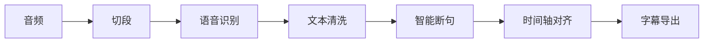

# Phase 17: Release Engineering 设计规格

## 概述

将 Subtap 从"可运行产品"升级为"可发布开源工具"，实现发布工程、Demo 系统、README 产品化。

## 设计决策

| 决策点 | 选择 |
|--------|------|
| CHANGELOG.md | 自动生成（git log / conventional commits） |
| RELEASE.md | 半自动（AI 整理 + 人工微调） |
| GitHub Release Page | 手写（用户视角） |
| pipeline 图 | Mermaid 格式 |
| TUI 示例 | 截图 |
| README 语言 | 中文 |
| 安装验证 | 自动化 + 手动复核 |
| 失败处理 | Fail Fast + Block Release |

## 任务分解

| 任务 | 优先级 | 依赖 |
|------|--------|------|
| A. CHANGELOG.md 自动生成 | 高 | 无 |
| B. RELEASE.md 半自动 | 高 | A |
| C. demo 系统增强 | 高 | 无 |
| D. README 产品化 | 高 | A, B, C |
| E. 安装体验验证（自动化） | 高 | D |
| F. release 质量检查脚本 | 高 | E |
| G. Git Release 收口 | 最高 | A-F |

## CHANGELOG.md 自动生成

**方案**：使用 `git log` + `conventional commits` 自动生成

```bash
# 生成 CHANGELOG.md
git log --oneline --no-merges | \
  grep -E "^(feat|fix|docs|refactor|test):" | \
  sed 's/^feat: /✨ /;s/^fix: /🐛 /;s/^docs: /📚 /;s/^refactor: /♻️ /;s/^test: /✅ /' > CHANGELOG.md
```

## RELEASE.md 半自动

**方案**：AI 整理 + 人工微调

```markdown
# Release v0.1.0

## 🎉 新特性
- Output Engine 统一输出管理
- TUI 颜色方案
- CLI `--timestamp/--no-timestamp` 参数

## 🐛 Bug 修复
- 修复 .gitignore 规则
- 修复 NamingStrategy 多余参数

## 📚 文档
- 添加 Phase 15+16 设计规格
- 添加 Phase 15+16 实现计划

## ✅ 测试
- 280 个测试全部通过
```

## demo 系统增强

**方案**：增强现有 `demo()` 命令

```python
@app.command()
def demo(
    output_dir: Path = Path("./demo_output"),
) -> None:
    """运行演示：使用内置测试音频展示完整流程"""
    # 1. 查找内置测试音频
    # 2. 执行完整 pipeline
    # 3. 输出 srt + report + metrics
    # 4. 展示 TUI
```

## README 产品化

**方案**：重写 README.md

```markdown
# Subtap

**本地优先的 AI 字幕生成引擎**

## ✨ 特性
- 🎯 完整 Pipeline
- 🧠 真实模型推理
- 🌏 中文优先
- 📊 TUI 可视化

## 📦 安装
```bash
pip install -e .
subtap setup
```

## 🚀 快速开始
```bash
subtap run video.mp3
```

## 🎬 Demo
```bash
subtap demo
```

## 📊 Pipeline


## 🖥️ TUI 示例


## 🧠 模型说明
- ASR: Qwen3-ASR-0.6B/1.7B
- Aligner: Qwen3-ForcedAligner-0.6B
```

## 安装体验验证（自动化）

**方案**：创建验证脚本

```bash
#!/bin/bash
# scripts/release-check.sh

set -e

echo "=== Release 质量检查 ==="

# 1. 检查依赖
echo "1. 检查依赖..."
pip install -e .

# 2. 检查 setup
echo "2. 检查 setup..."
subtap setup --skip-models

# 3. 检查 doctor
echo "3. 检查 doctor..."
subtap doctor

# 4. 检查 demo
echo "4. 检查 demo..."
subtap demo --help

# 5. 检查 output 结构
echo "5. 检查 output 结构..."
# ...

echo "=== 检查通过 ==="
```

## release 质量检查脚本

**方案**：创建 `scripts/release-check.sh`

```bash
#!/bin/bash
# scripts/release-check.sh

set -e

echo "=== Release 质量检查 ==="

# 检查项
CHECKS=(
    "pip install -e ."
    "subtap setup --skip-models"
    "subtap doctor"
    "subtap demo --help"
    "subtap run --help"
    "subtap models list"
)

for check in "${CHECKS[@]}"; do
    echo "检查: $check"
    if ! eval "$check"; then
        echo "❌ 检查失败: $check"
        exit 1
    fi
    echo "✓ 通过"
done

echo "=== 所有检查通过 ==="
```

## Git Release 收口

**方案**：执行 git 操作

```bash
# 1. 生成 CHANGELOG.md
# 2. 生成 RELEASE.md
# 3. 更新 README.md
# 4. 运行 release 检查
# 5. git tag v0.1.0
# 6. git push origin main
# 7. git push origin v0.1.0
```

## 验收标准

1. ✔ CHANGELOG.md 自动生成
2. RELEASE.md 半自动
3. demo 系统可运行
4. README 产品化
5. 安装体验验证通过
6. release 质量检查通过
7. Git tag 创建成功
8. GitHub Release Page 创建成功
